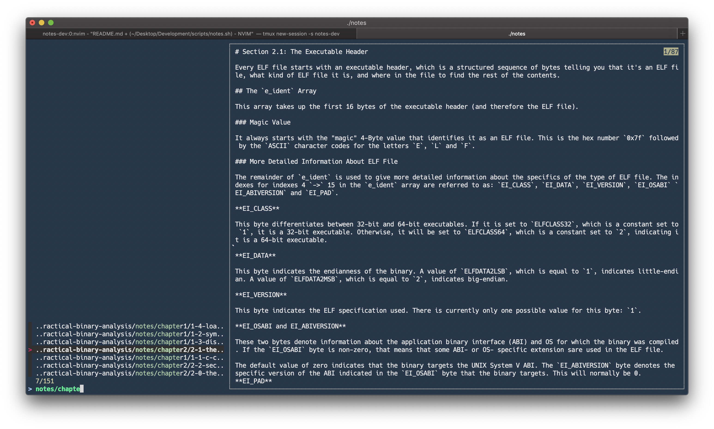

# fzf-notes



This script was originally written by Casey Brant, and explained in his blog post [Simple Notes Taking with `fzf` and `vim`](https://medium.com/adorableio/simple-note-taking-with-fzf-and-vim-2a647a39cfa).

I've modified and extended it to better suit my note taking style. It now supports the usage of multiple notebooks. Once a notebook is open, the file selector loops which allows you to jump from file to file quickly.

## Usage

```bash
fzf-notes [OPTIONS]
     fzf-integrated notetaking.
     Running this command without any arguments will open your default journal.
     Written by Aaron Lichtman: https://github.com/alichtman/fzf-notes

Options:
  -b                   browse notebooks
  -c                   show config file path
  --edit-config, -C    edit config
  --help, -h           show this help text
  -n                   open notebook by name
  -s                   search for file in notebook
```

Once installed, simply run `$ fzf-notes`. You will be led through the set up process the first time you run the program.

You can create new files by selecting `CREATE_NEW_FILE` at the menu.

## Dependencies

**macOS**

- `bash`
    - Tested on `v5.0`. macOS ships with an ancient version of bash, so if you're having issues running this, try upgrading to a more recent version.
- [`fzf`](https://github.com/junegunn/fzf)
    - `$ brew install fzf`
- [`yq`](https://github.com/mikefarah/yq/)
    * `$ brew install yq`
- [`gnu-getopt`](https://formulae.brew.sh/formula/gnu-getopt)
    * `$ brew install gnu-getopt`
    * Make sure to follow the post-install instructions.

## Installation

```bash
$ git clone git@github.com:alichtman/fzf-notes.git
$ cd fzf-notes
$ chmod +x fzf-notes && cp fzf-notes /usr/local/bin/fzf-notes
```

To update `fzf-notes`, come back to the directory you've cloned this repo into and run `$ git pull origin master`.

## Configuration

`fzf-notes` follows the [`XDG` spec](https://specifications.freedesktop.org/basedir-spec/basedir-spec-latest.html). The configuration file can be found at `$XDG_CONFIG_HOME/fzf-notes/fzf-notes.conf` if `$XDG_CONFIG_HOME` is set or `~/.config/fzf-notes/fzf-notes.conf`, otherwise.

It's a `YAML` file with the following structure:

```yaml
notebooks:
  default: ~/notes
  non-default: /Users/alichtman/notes2
  ...
```

Both absolute and tilde-prepended paths are valid.
